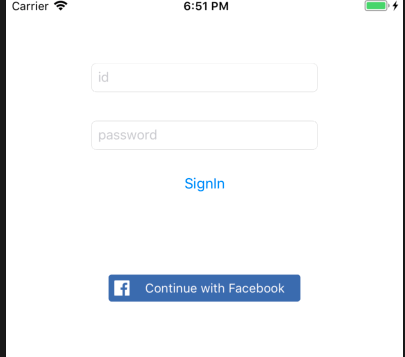
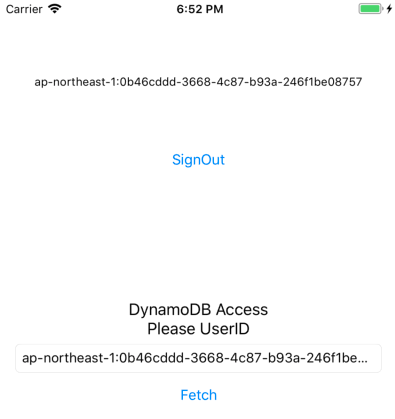
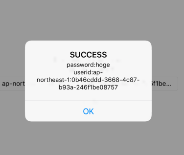
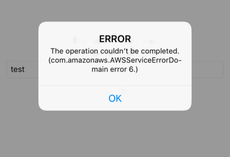

# CognitoIDPoolSample
CognitoIDPoolのサンプルコード

- CognitoUserプールに紐づくアカウントでのサインインとFacebookアカウントを使ったサインインに対応
- DynamoDBの行レベルアクセス制限にも対応

詳細は http://sakataharumi.hatenablog.jp/entry/2018/08/27/184146 をご確認ください

# Usage

0. `pod install`
1. CognitoUserプール、CognitoIDプールを生成
2. Facebookにアプリを登録する
3. info.plisitとConstant.swiftを自分の環境に合わせて書き換える
4. CognitoIDプール用のロールに [こちら](https://docs.aws.amazon.com/ja_jp/IAM/latest/UserGuide/reference_policies_examples_dynamodb_rows.html)を参照して作ったポリシーをアタッチする
5. DynamoDBに適切な名前でテーブルを作る。必要であればデータも幾つか挿入しておく

# UI

### ログイン画面

### ログイン成功後画面

### データFetch成功

### データFetch失敗

